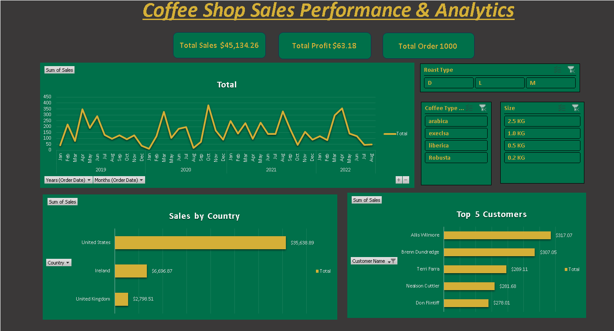
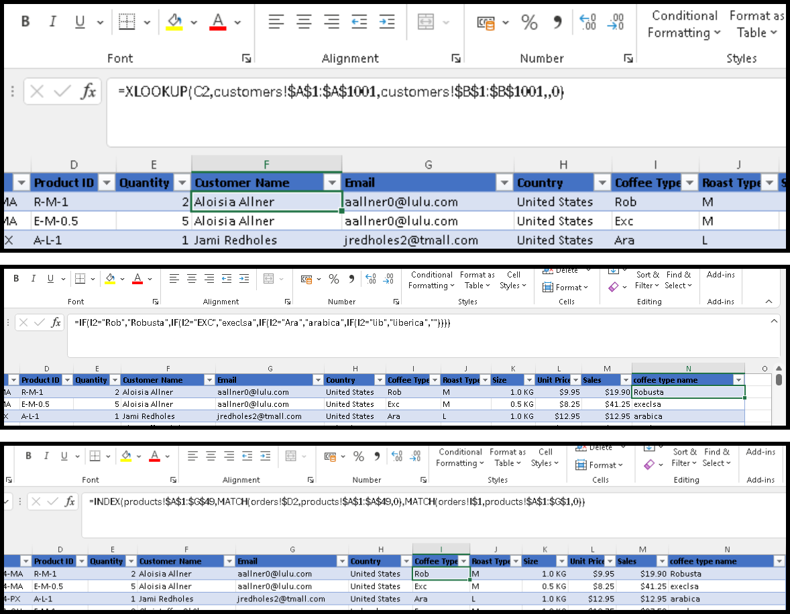
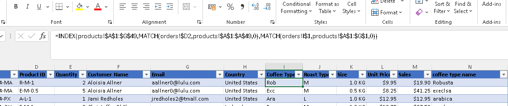

# Coffee Sales Dashboard

## About The Project
This dashboard analyzes retail coffee sales data from 2019 to 2022. I built this project entirely in **Excel** to demonstrate how raw data is transformed into actionable business insights—from cleaning and modeling to the final interactive visualization.

## The Business Problem
The goal was to answer three main questions for the stakeholders:
1.  **Sales Trends:** How is the business performing over time?
2.  **Top Markets:** Which countries are generating the most revenue?
3.  **Top Customers:** Who are the top 5 customers driving sales?

## Tools Used
* **Microsoft Excel** (Full Stack: Cleaning, Analysis, Visualization)
* **Formulas:** `XLOOKUP`, `INDEX MATCH`, Nested `IF`
* **Features:** Pivot Tables, Slicers, Timeline

## Project Workflow

### 1. Data Cleaning
Before analyzing, I made sure the data was clean and ready:
* **Date Formatting:** Standardized dates to `dd-mmm-yyyy` for accurate time-series analysis.
* **Duplicate Check:** Ran a strict check to ensure there were no duplicate records (Result: **0 duplicates found**).
* **Data Enrichment:** Added a **"Loyalty Card Status"** column using logic formulas to categorize members vs. non-members.

### 2. Data Modeling (Formula-Based)
Instead of using the automatic Data Model feature, I manually merged the tables to demonstrate formula logic:
* Used **`XLOOKUP`** to pull Customer Name and Country into the main table.
* Used **`INDEX MATCH`** to pull Product Details (a flexible alternative to VLOOKUP).
* Calculated total sales dynamically within the master dataset.

### 3. Dashboard Features
The final dashboard allows users to interact with the data:
* **Timeline:** Filter data by specific years or months.
* **Slicers:** Drill down by Roast Type, Size, and Loyalty Status.
* **Visuals:** Bar charts for top customers/countries and line charts for trends.

## Key Insights
* **US Dominance:** The United States is the biggest market, generating **~$35,000** in sales.
* **Ireland > UK:** Interestingly, Ireland comes in second with **$6,600**—doubling the revenue of the United Kingdom. This suggests a strong market potential in Ireland.
* **Top Spenders:** The top 5 customers (led by Allis Wilmore and Brenn Dundredge) have a balanced spending range between $270 - $310.

---
*Feel free to reach me at: **itsimamr@gmail.com***
